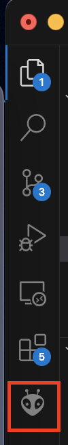
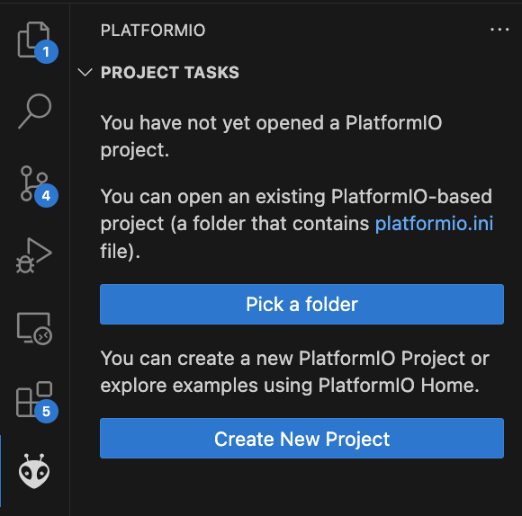
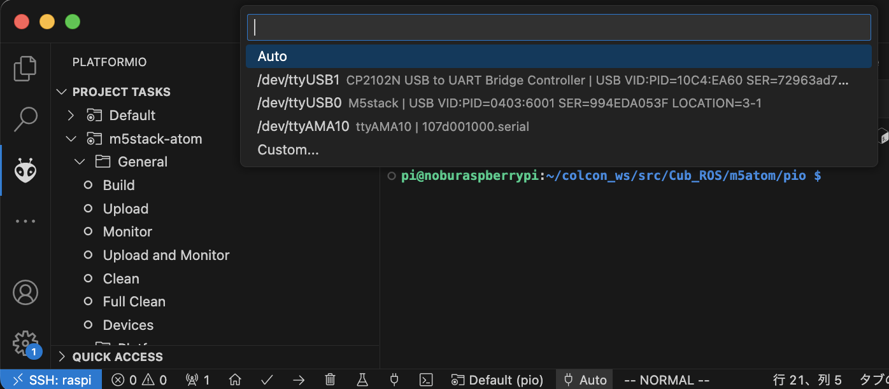

# Summary
mcubのM5 stack用プロジェクトです。  
VSCodeのPlatform IO（PIO)を使用してBuildすることを前提としています。
またRaspiから直接書き込むことを想定しています。
Raspiに対してSSH接続ができる状態にしてください。
  

参考:
> Visual Studio CodeでRaspberry Pi 4にSSH接続する方法  
https://note.com/echo_device/n/n3ce990fed57b

> Platform IOのインストール方法。（Platform IOのインストールまででよいです）   
https://hackmd.io/@aoiyu/HyfU9iXjS#PlatformIOのインストール


# PIOの開き方
1. ctrl+shift+@を押し、VSCのターミナルを起動
2. ターミナル上で、下記コマンドを実行  
```bash
sudo apt install python3-venv
```

3. サイドバーにあるPIOのマークを開く  


4. Pick a folderをクリック  


5. [pio/platfomio.ini](pio/platformio.ini)を選択する  
初回は必要なライブラリインストールが走るため、数分時間がかかります。

6. 画面下部にあるプラグマーク Auto ボタンをクリックし、M5STackのポートを選択する。


7. Build & M5stackへアップロード  
画面左のUploadボタンをクリック。[pio/src](pio/src)にあるコードが1~2分で転送されます。

# DOMAIN ID
m5stack内でmrosが動いており、DOMAIN IDが定義されています。お使いの環境に合わせてIDを変更してください。
[Domain ID](pio/src/main.cpp#L44)
```
rcl_init_options_t init_options; // Humble
size_t domain_id = 1; // ros Domain ID
```


