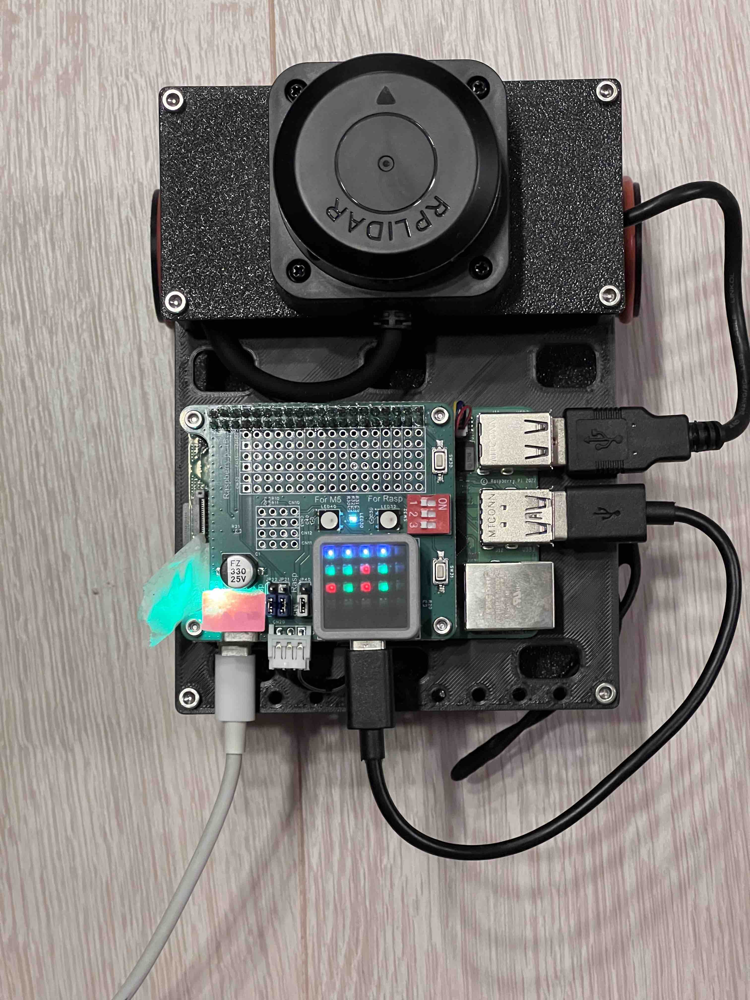

# control_mcub
mcubをRaspi経由で操縦するためのパッケージ群

# wheel_odometry
M5Atomからホイール回転量[pulse]を受け取り、odom、tfを出力するパッケージ。

# Requirement
・mcubを上から見て右をID1, 左をID2に設定していること
  IDの変更は下記を参照
  https://github.com/CoderDojoMusashikosugi/Cub_ROS/tree/feature-add-mcub-environment/support_tools/dynamixel  
・シリアルポートを有効化していること  
 有効化手順  
  /boot/firmware/config.txt　に下記を追記  
  dtoverlay=uart0,ctsrts

# Submoduleの取得
```bash
git submodule update --init --recursive
```
# build方法
コンテナ起動(run.sh実行)後に下記コマンドを実行
```bash
cd colcon_ws && \
colcon build --symlink-install && \
bashrc
```

# 使用方法
## M5Stackを使用する場合
### m5stackのコード書き込み
[/m5atom/README.md](/m5atom/README.md)を参照
### micro-ros-agentの起動
コマンド内のttyUSB0は環境に応じてM5のポートに切り替える。
```bash
ros2 run micro_ros_agent micro_ros_agent serial --dev /dev/ttyUSB0 -b 115200 -v6
```

### ATOM-agent間の接続確認
m5ATOMの最上部LEDが４つ白に点灯していることを確認。  
点灯していない場合は、micro-ros-agentが起動していることを確認した上で、m5ATOM左にあるボタンを押し、Resetする。  


### キーボードの矢印キーで制御するteleopノードを起動
新たなターミナルを別途起動し、コンテナ内に入った(run.sh実行）後、下記コマンドを実行
```bash
ros2 run control_mcub mcub_teleop_key
```
矢印キーで移動。スペースで停止。

### ホイールオドメトリを起動する場合
新たなターミナルを別途起動し、コンテナ内に入った(run.sh実行）後、下記コマンドを実行
```bash
ros2 run wheel_odometry wheel_odometry_node
```

## M5Stackを使用しない場合
### コンテナ内でDynamixelを制御するノードを起動する
```bash
ros2 run control_mcub control_mcub_moter_node
```
### キーボードの矢印キーで制御するteleopノードを起動
新たなターミナルを別途起動し、コンテナ内に入った(run.sh実行）後、下記コマンドを実行
```bash
ros2 run control_mcub mcub_teleop_key
```
矢印キーで移動。スペースで停止。
